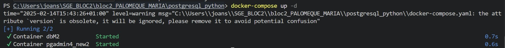
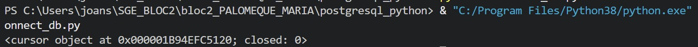

# Sistema de gestion empresarial 

Iniciaremos creando todas las carpetas requeridas en las instruccioones y ejecutaremos el archivo  "docker-compose.yaml" para construir y luego iniciaer los contenedores. 

Antes de ejecutart "connect_db.py", sera necesario  crear la base de datos, antes de establecer la conexion. 

La siguiente imagen nos muestra que se ha establecido la conexion de forma correcta, ya que el archivo consta con los parametros de la base de datos creada (nombre de la base de datos, usuario, contraseña, el host y el puerto de esta). 

Para poder hacer el insert, deberemos crear primero la tabla "Clientes", esto lo haremos ejecutando "create_table_to_db.py",  el cual crea dicha tabla con las  columnas para nombre, dirección, teléfono, correo electrónico y fecha de cumpleaños, si no existe (como en este caso).

